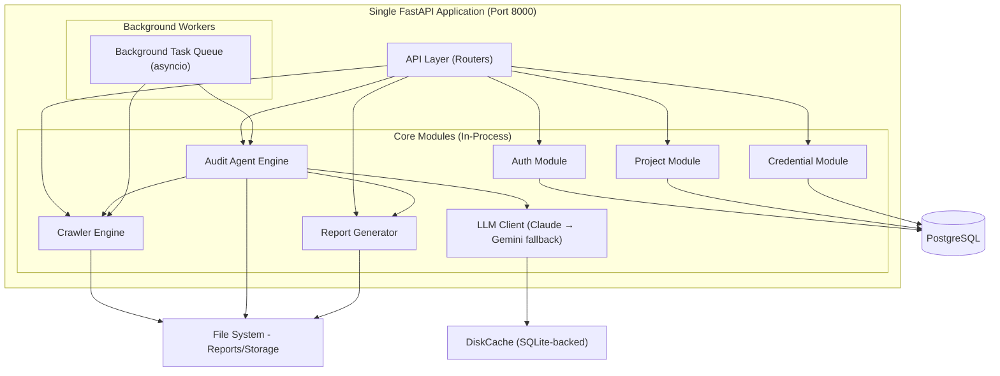
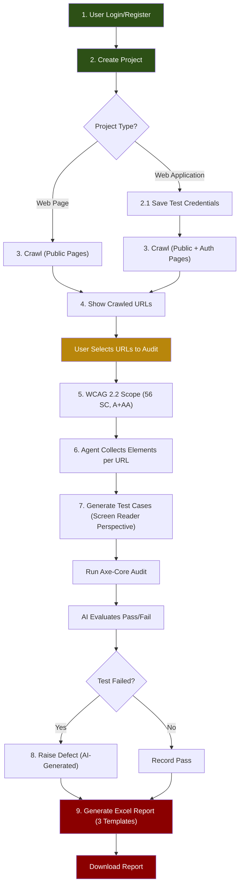

# A11ySense — Complete Restructuring & Production-Ready Plan

> **Goal:** Collapse 6 microservices into a single, efficient monolith. Remove billing, credits, API keys, and pricing. Build the core accessibility audit pipeline to production quality.

---

## 📊 Current State Analysis

### What Exists Today (6 Microservices + Redis Event Bus)

| Service | Port | Purpose | Lines (Core) |
|---------|------|---------|--------------|
| **Gateway** | 8000 | Auth, RBAC, proxy to other services | ~350 |
| **Crawler** | 8003 | Playwright-based web crawling | ~1,062 |
| **Agent** | 8001 | Orchestrator + Manager/Auditor agents | ~995 |
| **Analyzer** | 8004 | Scoring, dedup, trend analysis | ~49 |
| **LLM** | 8005 | Claude/Gemini/Groq router + caching | ~208 |
| **Reporting** | 8002 | Allure reports, Excel, DOCX certificate | ~285 |

### Inter-Service Communication
- **Redis Streams** — event bus between Gateway → Crawler, Crawler → Agent, Agent → Reporting
- **HTTP** — Gateway proxies to Agent; Agent calls LLM, Analyzer, Reporting via HTTP

### What Must Be REMOVED (Per Your Requirements)

| Feature | Files Affected |
|---------|---------------|
| **Billing/Credits** | `billing.py`, `billing_service.py`, `billing_repo.py`, `billing_manager.py`, `BillingPage`, `CreditsPage`, `CreditTransaction` model |
| **API Key Management** | `keys.py`, `key_service.py`, `ApiKey` model, `ApiKeysPage` |
| **Stripe Integration** | `stripe_customer_id`, `stripe_subscription_id` columns in Organization |
| **Pay-As-You-Go** | `pay_as_you_go_enabled` column, toggle endpoint |
| **Credit Enforcement** | Credit balance checks in `proxy_service.py` before starting audit |
| **Prometheus/Metrics** | `prometheus-fastapi-instrumentator` across all 6 services |
| **Redis dependency** | Redis Streams event bus + Redis-based LLM cache |
| **Multiple Dockerfiles** | 6 separate `Dockerfile` files, 6 PM2 entries |

---

## 🏗️ Target Architecture: Clean Monolith



### Why Monolith Is Better Here

1. **No network hops** — Crawler → Agent → LLM → Reporting all happen in-process (function calls, not HTTP)
2. **Single deploy** — One `uvicorn` process, one `Dockerfile`, one PM2 entry
3. **Shared memory** — Background tasks, LLM cache, progress tracking all in-process
4. **Simpler debugging** — Single log stream, single traceback
5. **Lower resource usage** — 1 process instead of 6, no Redis overhead
6. **Cross-platform** — No Redis dependency; works identically on Windows and Ubuntu

---

## 📋 Implementation Plan (Phased)

### Phase 1: Cleanup — Remove Dead Weight
> **Estimated effort: 2-3 hours**

#### 1.1 Backend Cleanup

**Files/Modules to DELETE entirely:**

```
# Billing & Credits
backend/common/billing/                          # billing_manager.py
backend/services/gateway/app/api/billing.py
backend/services/gateway/app/services/billing_service.py
backend/services/gateway/app/schemas/billing.py
backend/services/gateway/app/repository/billing_repo.py  (if exists)

# API Key Management
backend/services/gateway/app/api/keys.py
backend/services/gateway/app/services/key_service.py
backend/services/gateway/app/schemas/keys.py

# Redis Event Bus
backend/common/utils/event_bus.py

# All Dockerfiles (6)
backend/services/*/Dockerfile

# PM2 ecosystem configs (replace with single)
ecosys.config.js
ecosystem.config.js
```

**Database model changes** ([models.py](file:///c:/External-projects/WinVinaya/a11ysense/backend/common/database/models.py)):
- DELETE: `ApiKey` model entirely
- DELETE: `CreditTransaction` model entirely
- REMOVE from `Organization`: `plan_tier`, `credit_balance`, `billing_status`, `stripe_customer_id`, `stripe_subscription_id`, `pay_as_you_go_enabled`
- ADD to `Project`: `project_type` field (`web_page` | `web_application`), `base_url` field

**Gateway main.py cleanup:**
- Remove `billing_router`, `keys_router` imports and router registration
- Remove Prometheus instrumentator from all services
- Remove credit balance checks from `proxy_service.py`

#### 1.2 Frontend Cleanup

**Pages to DELETE:**
```
frontend/src/pages/billing/          # BillingPage
frontend/src/pages/credits/          # CreditsPage
frontend/src/pages/api-keys/         # ApiKeysPage
frontend/src/components/billing/
frontend/src/components/credits/
frontend/src/components/api-keys/
```

**Router cleanup** ([AppRouter.tsx](file:///c:/External-projects/WinVinaya/a11ysense/frontend/src/router/AppRouter.tsx)):
- Remove `billingRoute`, `creditsRoute`, `apiKeysRoute` from route tree
- Remove corresponding imports

---

### Phase 2: Monolith Consolidation
> **Estimated effort: 4-6 hours**

#### 2.1 New Directory Structure

```
backend/
├── app/
│   ├── __init__.py
│   ├── main.py                    # Single FastAPI entrypoint
│   ├── api/                       # All API routers
│   │   ├── __init__.py
│   │   ├── auth.py                # Login, Register
│   │   ├── projects.py            # CRUD + project_type
│   │   ├── credentials.py         # Test credential CRUD
│   │   ├── crawl.py               # Start crawl, get crawl status
│   │   ├── audit.py               # Start audit, get status, stop/pause/resume
│   │   ├── reports.py             # Download reports (Excel, HTML, DOCX)
│   │   ├── dashboard.py           # Stats overview
│   │   └── users.py               # User management (Admin)
│   ├── core/                      # Business logic engines
│   │   ├── crawler/
│   │   │   ├── __init__.py
│   │   │   ├── engine.py          # Merged from crawler.py (57KB)
│   │   │   └── login_handler.py   # Merged from login_service.py
│   │   ├── agent/
│   │   │   ├── __init__.py
│   │   │   ├── orchestrator.py    # Merged from orchestrator.py (49KB)
│   │   │   ├── manager.py         # Merged from manager.py (25KB)
│   │   │   ├── auditor.py         # Merged from auditor.py (12KB)
│   │   │   └── prompts/           # XML prompts
│   │   ├── llm/
│   │   │   ├── __init__.py
│   │   │   ├── client.py          # Claude primary, Gemini fallback
│   │   │   ├── cache.py           # DiskCache-backed LLM response cache
│   │   │   └── compression.py     # Prompt compression
│   │   ├── analyzer/
│   │   │   ├── __init__.py
│   │   │   ├── heuristics.py      # Dedup, scoring
│   │   │   └── scoring.py
│   │   ├── reporting/
│   │   │   ├── __init__.py
│   │   │   ├── excel_report.py    # Excel report gen (defect + testcase + WCAG ref)
│   │   │   ├── certificate.py     # DOCX conformance certificate
│   │   │   └── templates/         # DOCX templates
│   │   └── skills/                # Browser, keyboard, screen reader skills
│   │       ├── __init__.py
│   │       ├── browser.py
│   │       ├── keyboard_nav.py
│   │       ├── screen_reader.py
│   │       ├── landmark.py
│   │       └── scanner.py
│   ├── models/                    # SQLAlchemy models
│   │   ├── __init__.py
│   │   ├── base.py
│   │   ├── user.py
│   │   ├── project.py
│   │   ├── audit.py
│   │   └── credential.py
│   ├── schemas/                   # Pydantic request/response schemas
│   │   ├── __init__.py
│   │   ├── auth.py
│   │   ├── project.py
│   │   ├── credential.py
│   │   ├── crawl.py
│   │   ├── audit.py
│   │   └── report.py
│   ├── repository/                # Database access layer
│   │   ├── __init__.py
│   │   ├── user_repo.py
│   │   ├── project_repo.py
│   │   ├── audit_repo.py
│   │   └── credential_repo.py
│   ├── services/                  # Service layer (thin orchestration)
│   │   ├── __init__.py
│   │   ├── auth_service.py
│   │   ├── project_service.py
│   │   ├── crawl_service.py
│   │   ├── audit_service.py
│   │   └── report_service.py
│   ├── auth/                      # JWT, password hashing, RBAC
│   │   ├── __init__.py
│   │   ├── jwt_utils.py
│   │   └── deps.py
│   ├── config/                    # Environment, settings
│   │   ├── __init__.py
│   │   └── settings.py
│   ├── constants/
│   │   ├── __init__.py
│   │   └── wcag.py                # WCAG 2.2 A+AA criteria map (56 SC)
│   └── utils/
│       ├── __init__.py
│       ├── storage.py
│       └── exceptions.py
├── migrations/                    # Alembic
├── storage/                       # Reports, screenshots, logs, diskcache
│   └── cache/                     # DiskCache SQLite files
├── requirements.txt               # Trimmed dependencies
├── alembic.ini
└── Dockerfile                     # Single Dockerfile
```

#### 2.2 Consolidation Steps

1. **Create `backend/app/main.py`** — Single FastAPI app with all routers
2. **Move crawler engine** — `services/crawler/app/core/crawler.py` → `app/core/crawler/engine.py` (direct import, no HTTP)
3. **Move agent logic** — `services/agent/app/agents/*` + `services/agent/app/services/orchestrator.py` → `app/core/agent/` (direct function calls)
4. **Move LLM client** — `services/llm/app/core/router.py` → `app/core/llm/client.py` (direct import, no HTTP)
5. **Move analyzer** — `services/analyzer/app/core/*` → `app/core/analyzer/` (direct import)
6. **Move reporting** — `services/reporting/app/services/*` → `app/core/reporting/` (direct import)
7. **Replace Redis Streams** — Replace event bus publish/subscribe with `asyncio.create_task()` for background work
8. **Replace Redis LLM cache** — Use `diskcache.Cache` (SQLite-backed, cross-platform) instead of Redis

#### 2.3 Key Refactoring: HTTP → Direct Calls

**Before (Microservices):**
```python
# proxy_service.py — Gateway calls Agent via HTTP
async with httpx.AsyncClient() as client:
    response = await client.post(f"{AGENT_SERVICE_URL}/start_audit", json=data)
```

**After (Monolith):**
```python
# audit_service.py — Direct function call
from app.core.agent.orchestrator import audit_orchestrator

task = await audit_orchestrator.run_audit(request, org_id, proj_id)
```

**Before (Agent calls LLM via HTTP):**
```python
response = await client.post(f"{LLM_SERVICE_URL}/generate", json=payload)
```

**After (Monolith):**
```python
from app.core.llm.client import llm_client

response = await llm_client.generate(prompt, system_message, session_id)
```

#### 2.4 Cache Strategy: DiskCache (Replaces Redis)

> [!IMPORTANT]
> Redis does not run natively on Windows. We replace it with **`diskcache`** — a SQLite-backed key-value cache that is:
> - ✅ Cross-platform (Windows + Ubuntu + macOS)
> - ✅ Zero external dependencies (no server process needed)
> - ✅ Thread-safe and process-safe
> - ✅ Supports TTL expiration, size limits, and eviction policies
> - ✅ Persistent across restarts (SQLite file on disk)
> - ✅ Benchmarked at ~100K ops/sec (more than sufficient for LLM cache)

**Implementation:**
```python
# app/core/llm/cache.py
import diskcache
from app.config.settings import get_storage_path

_cache = diskcache.Cache(
    directory=get_storage_path("cache/llm"),
    size_limit=500 * 1024 * 1024,     # 500 MB max
    eviction_policy="least-recently-used"
)

def get_cached_completion(prompt: str, system_message: str) -> dict | None:
    """Look up a cached LLM response by prompt hash."""
    import hashlib
    key = hashlib.sha256(f"{system_message}::{prompt}".encode()).hexdigest()
    return _cache.get(key)

def set_cached_completion(prompt: str, system_message: str, response: dict, ttl: int = 86400) -> None:
    """Cache an LLM response with 24-hour TTL."""
    import hashlib
    key = hashlib.sha256(f"{system_message}::{prompt}".encode()).hexdigest()
    _cache.set(key, response, expire=ttl)
```

**LLM Session Tracking** — Token usage tracking currently in Redis will be moved to PostgreSQL (a new `llm_session_usage` table) for durability and simplicity.

---

### Phase 3: Core Workflow Implementation
> **Estimated effort: 6-8 hours**

This is the critical flow you described:



#### 3.1 Project Model Enhancement

```python
class Project(Base):
    __tablename__ = "projects"
    
    id = Column(UUID, primary_key=True, default=uuid.uuid4)
    name = Column(String, nullable=False)
    base_url = Column(String, nullable=False)          # NEW
    project_type = Column(String, nullable=False)       # NEW: "web_page" | "web_application"
    organization_id = Column(UUID, ForeignKey("organizations.id"), nullable=False)
    created_at = Column(DateTime, default=datetime.utcnow)
```

#### 3.2 Crawler Enhancement

Current crawler ([crawler.py](file:///c:/External-projects/WinVinaya/a11ysense/backend/services/crawler/app/core/crawler.py)) already handles:
- ✅ Playwright-based crawling
- ✅ Cookie/CDN bypass
- ✅ Authenticated page crawling
- ✅ URL deduplication (query param stripping)

**Enhancements needed:**
- Cloudflare bypass (stealth mode with `playwright-stealth` or custom headers)
- Better query parameter normalization (strip all query params by default, configurable)
- Separate auth vs unauth page discovery lists

#### 3.3 Audit Agent Enhancement

Current agent ([orchestrator.py](file:///c:/External-projects/WinVinaya/a11ysense/backend/services/agent/app/services/orchestrator.py)) already handles:
- ✅ Multi-page orchestration
- ✅ Axe-core scanning
- ✅ AI test case generation
- ✅ Pass/Fail evaluation
- ✅ WCAG criteria mapping

**Enhancements needed:**
- Strict WCAG 2.2 only (56 success criteria, Level A + AA)
- Per-element test case generation from screen reader perspective
- Use credentials for authenticated page auditing
- AI model priority: Claude primary → Gemini fallback

#### 3.4 Report Template Implementation

Based on your screenshots, three Excel report sheets are generated per audit:

---

**Sheet 1: Defect Report (Red Header — `#8B0000`)**

| Column | Description |
|--------|-------------|
| Defect ID | Auto-generated unique ID |
| Test Case ID | Reference to test case |
| Page URL | URL where defect found |
| Principle | WCAG Principle (Perceivable / Operable / Understandable / Robust) |
| Level | A or AA |
| Element / Component (Pass or Fail) | HTML element with FAIL status |
| Severity | Critical / Major / Minor |
| WCAG Criteria | e.g. 1.1.1 Non-text Content |
| Verification Status | Open |
| Guidelines | WCAG guideline text |
| Defect Brief | AI-generated description of the issue |
| Actual Behavior | What was observed (screen reader output, missing attribute, etc.) |
| Expected Behavior | What should happen per WCAG standard |
| Screen Reader Behavior | How the screen reader currently announces the element |
| Action to Fix | Step-by-step remediation instructions |

---

**Sheet 2: Test Case Report (Blue Header — `#1a237e`)**

| Column | Description |
|--------|-------------|
| Test Case ID | Auto-generated unique ID |
| Test Case Name | AI-generated descriptive name |
| Page Title | Page title from DOM `<title>` tag |
| Page URL | URL being tested |
| WCAG Criteria | e.g. 1.1.1 Non-text Content |
| WCAG Principle | Perceivable / Operable / Understandable / Robust |
| Level | A or AA |
| Element / Component (Pass or Fail) | Target HTML element |
| Description | AI-generated explanation of what the test validates |
| Expected Result | What should happen if the element is accessible |
| Actual Result | What was actually observed during the test |
| Severity | Critical / Major / Minor |
| Status | PASS / FAIL |
| Observation | Additional notes on findings |

---

**Sheet 3: WCAG 2.2 Criteria Reference (Light Blue Header — `#1565c0`)**

| Column | Description |
|--------|-------------|
| S.No | Sequential number (1–56) |
| SC Number | e.g. 1.1.1 |
| Success Criterion Name | Full name (e.g. "Non-text Content") |
| WCAG Version | 2.2 |
| Level | A or AA |
| Principle | Perceivable / Operable / Understandable / Robust |
| Guideline | Parent guideline (e.g. "1.1 Text Alternatives") |
| Description / Requirement | Full description of the success criterion |

---

> [!NOTE]
> All three sheets are generated in a **single `.xlsx` file** using `openpyxl`. Header rows use the exact colors from your screenshots. The WCAG reference sheet (Sheet 3) is auto-populated from the existing [wcag.py](file:///c:/External-projects/WinVinaya/a11ysense/backend/common/constants/wcag.py) constants — all 56 Level A+AA criteria from WCAG 2.2.

---

### Phase 4: Frontend Streamlining
> **Estimated effort: 3-4 hours**

#### 4.1 Simplified Route Structure

```
/auth/signin              → Login
/auth/signup              → Register
/org/:orgId/dashboard     → Dashboard (audit history, stats)
/org/:orgId/projects      → Project list + Create project wizard
/org/:orgId/projects/:id  → Project detail (crawl → select → audit flow)
/org/:orgId/audits        → Audit history
/org/:orgId/audits/:id    → Audit detail + report download
/org/:orgId/credentials   → Credential management
/org/:orgId/users         → User management (Admin only)
```

**Pages to REMOVE:** `BillingPage`, `CreditsPage`, `ApiKeysPage`, `AgentsConsole`

#### 4.2 New Project Creation Wizard

```
Step 1: Project Name + Base URL + Type (Web Page / Web Application)
Step 2: (If Web Application) → Add test credentials
Step 3: Click "Discover Pages" → shows crawl progress
Step 4: Crawl results → checkboxes to select URLs
Step 5: Click "Start Audit" → runs WCAG 2.2 A+AA audit
Step 6: Results → Download Excel report (3 sheets)
```

---

### Phase 5: Production Hardening
> **Estimated effort: 2-3 hours**

- [ ] Remove `DEBUG=True` from production
- [ ] Add proper `logging` throughout with structured JSON format
- [ ] Add request rate limiting (per-user, not global)
- [ ] Add health check endpoint (`/health`)
- [ ] Add graceful shutdown handling
- [ ] Single `Dockerfile` with multi-stage build
- [ ] Single `docker-compose.yml` (app + postgres only, no Redis)
- [ ] Alembic migration for schema changes (remove billing columns, add project_type)
- [ ] Environment-specific config loading (dev/qa/prod)
- [ ] Secure credential encryption (already exists via Fernet in `PageCredential`)

---

## 🛠️ Tech Stack (Final)

| Layer | Technology | Why |
|-------|------------|-----|
| **Framework** | FastAPI + Uvicorn | Async, fast, production-ready |
| **Database** | PostgreSQL + SQLAlchemy | Relational data, existing setup |
| **Migrations** | Alembic | Already configured |
| **Auth** | JWT (PyJWT) + bcrypt | Already implemented |
| **Browser** | Playwright | Already implemented, handles CDN/CF bypass |
| **Accessibility** | axe-core (via Playwright) | Industry standard |
| **AI Primary** | Claude (Anthropic SDK) | Best for structured analysis |
| **AI Fallback** | Gemini (Google SDK) | Reliable fallback |
| **Cache** | **diskcache** (SQLite-backed) | Cross-platform (Windows + Ubuntu), zero-config, no server process, persistent, thread-safe, ~100K ops/sec |
| **Reports** | openpyxl (Excel) + python-docx | Template-based reports matching your 3 screenshot templates |
| **Frontend** | React + Vite + MUI + TanStack Router | Already implemented |

### Dependencies to REMOVE
```
prometheus-client                 # No metrics instrumentation needed
prometheus-fastapi-instrumentator # No metrics instrumentation needed
groq                              # Not needed per requirements (Claude + Gemini only)
allure-python-commons             # Replace with direct Excel generation
redis                             # Replaced by diskcache (cross-platform)
```

### Dependencies to ADD
```
diskcache>=5.6.3                  # SQLite-backed cache (replaces Redis)
```

---

## 📐 Execution Order

| # | Phase | Description | Depends On |
|---|-------|-------------|------------|
| 1 | **Cleanup** | Delete billing, credits, API keys, metrics, Redis event bus | — |
| 2 | **Monolith** | Consolidate 6 services → 1 app, replace Redis with diskcache | Phase 1 |
| 3 | **Core Logic** | Project type flow, crawler enhancements, WCAG 2.2 scoping | Phase 2 |
| 4 | **Reports** | Excel report with 3 sheets (Defect, Test Case, WCAG Reference) | Phase 3 |
| 5 | **Frontend** | Cleanup + project wizard + report download | Phases 1-4 |
| 6 | **Hardening** | Docker, logging, health checks, security | Phase 5 |

---

## ⚠️ What We Keep (Valuable Existing Code)

These files contain **critical production logic** that will be preserved and consolidated:

- [crawler.py](file:///c:/External-projects/WinVinaya/a11ysense/backend/services/crawler/app/core/crawler.py) — 57KB, full Playwright crawler
- [orchestrator.py](file:///c:/External-projects/WinVinaya/a11ysense/backend/services/agent/app/services/orchestrator.py) — 49KB, audit orchestration
- [manager.py](file:///c:/External-projects/WinVinaya/a11ysense/backend/services/agent/app/agents/manager.py) — 25KB, agent manager
- [screen_reader.py](file:///c:/External-projects/WinVinaya/a11ysense/backend/services/agent/app/skills/implementations/screen_reader.py) — 54KB, screen reader skill
- [keyboard_nav.py](file:///c:/External-projects/WinVinaya/a11ysense/backend/services/agent/app/skills/implementations/keyboard_nav.py) — 32KB, keyboard navigation
- [landmark.py](file:///c:/External-projects/WinVinaya/a11ysense/backend/services/agent/app/skills/implementations/landmark.py) — 21KB, landmark detection
- [login_service.py](file:///c:/External-projects/WinVinaya/a11ysense/backend/services/crawler/app/services/login_service.py) — 16KB, auth handling
- [report_service.py](file:///c:/External-projects/WinVinaya/a11ysense/backend/services/reporting/app/services/report_service.py) — 14KB, report generation
- [allure_manager.py](file:///c:/External-projects/WinVinaya/a11ysense/backend/services/reporting/app/services/allure_manager.py) — 18KB, test result formatting
- [router.py](file:///c:/External-projects/WinVinaya/a11ysense/backend/services/llm/app/core/router.py) — LLM fallback chain (Claude → Gemini)
- [wcag.py](file:///c:/External-projects/WinVinaya/a11ysense/backend/common/constants/wcag.py) — WCAG criteria map
- [auth_service.py](file:///c:/External-projects/WinVinaya/a11ysense/backend/services/gateway/app/services/auth_service.py) — Login/register
- [credential_service.py](file:///c:/External-projects/WinVinaya/a11ysense/backend/services/gateway/app/services/credential_service.py) — Encrypted credentials
- [prompts/](file:///c:/External-projects/WinVinaya/a11ysense/backend/services/agent/app/prompts) — Auditor and Manager XML prompts
- [templates/](file:///c:/External-projects/WinVinaya/a11ysense/backend/services/reporting/app/templates) — DOCX conformance certificate template

---

> [!IMPORTANT]
> This plan restructures the architecture without losing any core accessibility audit logic. Every line of crawler, agent, LLM, and reporting code is preserved and consolidated. The only things removed are billing, credits, API keys, metrics instrumentation, Redis dependency, and the inter-service HTTP overhead.
