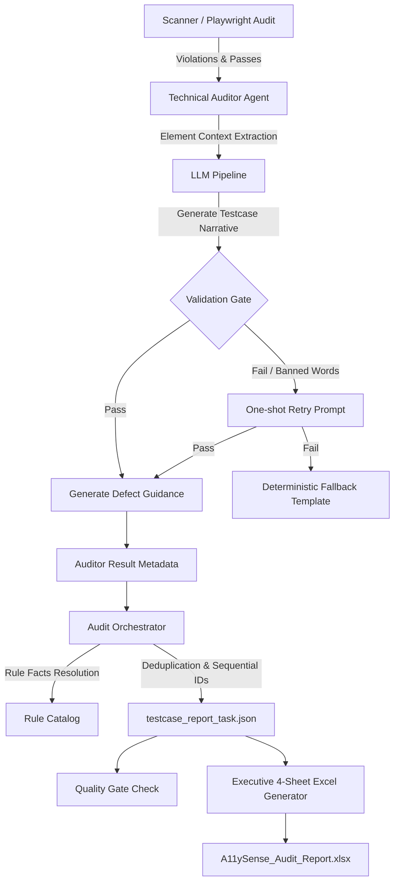

# A11ySense AI — Report Quality Pipeline Architecture

## Executive Overview
The A11ySense Report Quality Pipeline produces compliance-grade accessibility audit reports for enterprise web applications. It replaces fragile, mock-polluted LLM responses with a deterministic, resilient architecture that combines:
- **Deterministic Facts from Code** (`rule_catalog.py`)
- **Plain-English Non-Technical Narratives from AI** with strict validation (`narrative.py`)
- **1 Unique Element = 1 Test Case = 1 Defect** mapping with deduplication (`orchestrator.py`)
- **Executive 4-Sheet Excel Reports** with formula injection protection (`excel_generator.py`)
- **Automated Quality Gate** preventing regressions (`quality_gate.py`)

---

## 1. Pipeline Architecture

---

## 2. Core Pillars

### Pillar 1: Facts from Code, Words from AI
The LLM is **never** permitted to hallucinate or emit regulatory facts.
All regulatory facts are strictly resolved by `resolve_rule(rule_id)` from `common/constants/rule_catalog.py`:
- `wcag_criteria` (e.g. `4.1.2 Name, Role, Value`)
- `wcag_level` (`A`, `AA`, or `Best Practice`)
- `wcag_principle` (`Perceivable`, `Operable`, `Understandable`, `Robust`, or `N/A`)
- `severity` (`Critical`, `Serious`, `Moderate`, `Minor`)
- `status` (`FAIL`, `PASS`, `NOT_APPLICABLE`, `MANUAL_REVIEW`)

The LLM is prompted solely for human language:
1. `description` (non-technical summary of why the element creates a barrier)
2. `expected_result` (what standard behavior is expected)
3. `actual_result` (what happens when a screen reader or keyboard reaches this item)
4. `steps_to_reproduce` (numbered screen-reader/keyboard reproduction steps)
5. `business_impact` & `fix_steps`

### Pillar 2: Plain-English Narratives & Banned Words
To ensure reports are immediately actionable by non-technical managers and business stakeholders, developer jargon is banned from non-technical fields (`description`, `expected_result`, `actual_result`).

**Banned Words (case-insensitive whole-word regex):**
`aria`, `dom`, `attribute`, `selector`, `tag`, `markup`, `role`, `tabindex`, `node`, `element id`, `wcag`, `axe`, `semantic`, `programmatic`, `contrast ratio`.

If any banned word is detected in the LLM response:
1. A single retry prompt is sent to the LLM explaining the violation.
2. If the retry fails or the LLM is unreachable, the pipeline falls back to the deterministic, high-quality narrative in `sc_catalog.py` via `fallback_narrative()`.
3. **No mock sentences** (`"Mock finding"`, `"Mock audit completed"`) are ever emitted.

### Pillar 3: 1:1 Element and Defect Mapping
- **1 Unique Element = 1 Test Case**: Multi-node scanner violations are unpacked so every individual failing element is evaluated on its own merits.
- **Deduplication**: If an identical element (`rule_id`, `normalized_html`, `page_url`) appears multiple times on the same page (e.g. a repeated store button), the occurrences are merged into 1 testcase row with:
  - `repeat_count: N`
  - `remarks: "Same problem found N times on this page."`
- **Sequential IDs**:
  - `testcase_id`: strictly sequential `TC-0001`, `TC-0002`, `TC-0003`, ...
  - `defect_id`: strictly sequential `DEF-0001`, `DEF-0002`, ... for `FAIL` rows (`N/A` for others).
  - Every `FAIL` testcase has exactly 1 corresponding defect (1:1 mapping).

### Pillar 4: Criteria Scope Completeness
The report covers all 50 WCAG 2.2 criteria:
- **26 Automated Scope Criteria** (`A11YSENSE_AUDIT_SCOPE`):
  - `FAIL`: If any element on audited pages fails.
  - `PASS`: If elements were checked and 0 violations found (`actual_result`: `"All N elements checked on this page meet this requirement."`).
  - `NOT_APPLICABLE`: If no elements applicable to this criterion were present on the website.
- **24 Manual Review Criteria** (`A11YSENSE_MANUAL_REVIEW_CRITERIA`):
  - `MANUAL_REVIEW`: All 24 criteria are reported with `Page URL = "All pages"` and comprehensive plain-English testing steps from `sc_catalog.py`.

---

## 3. Excel Report Specification (`excel_generator.py`)

The generated workbook consists of 4 sheets:

### Sheet 1: `Summary`
- Executive Overview block (Audit URL, Date, Pages Scanned count & list).
- Key KPI Table (Count & percentage by Status).
- Defect Severity Breakdown (Critical, Serious, Moderate, Minor).
- Defect Principle Breakdown (Perceivable, Operable, Understandable, Robust).
- Top 10 Failed WCAG Criteria.
- Quality Gate Status Card.

### Sheet 2: `Test Case Report` (14 Columns, Dark Blue Header `#1A237E`)
1. `S.No`
2. `Testcase ID` (e.g. `TC-0001`)
3. `Page URL` (clickable hyperlink)
4. `WCAG Criteria` (e.g. `4.1.2 Name, Role, Value`)
5. `Level` (`A`, `AA`)
6. `WCAG Principle` (`Robust`, `Operable`, etc.)
7. `Element HTML Snippet` (Monospace Consolas 9pt)
8. `Description` (Plain English)
9. `Expected Result` (Plain English)
10. `Actual Result` (Plain English)
11. `Steps to Reproduce` (Numbered steps)
12. `Status` (`FAIL`, `PASS`, `NOT_APPLICABLE`, `MANUAL_REVIEW` with distinct fills)
13. `Severity` (`Critical`, `Serious`, `Moderate`, `Minor`, `N/A`)
14. `Remarks`

### Sheet 3: `Defects Report` (16 Columns, Dark Red Header `#8B0000`)
1. `S.No`
2. `Defect ID` (e.g. `DEF-0001`)
3. `Testcase ID` (e.g. `TC-0001`)
4. `Page URL` (clickable hyperlink)
5. `WCAG Criteria`
6. `Level`
7. `WCAG Principle`
8. `Element HTML Snippet` (Monospace Consolas 9pt)
9. `Description`
10. `Expected Result`
11. `Actual Result`
12. `Steps to Reproduce`
13. `Status` (Default `"Open"`, with Excel Data-Validation dropdown: `Open`, `In Progress`, `Resolved`, `Closed`)
14. `Severity`
15. `AI Suggestion to Fix`
16. `Remarks`

### Sheet 4: `WCAG Criteria Reference` (8 Columns, Light Blue Header `#1565C0`)
Contains the full reference map of all WCAG 2.2 Success Criteria.

### Security & Presentation Highlights
- **Formula Injection Defense**: All cell strings starting with `=`, `+`, `-`, or `@` are automatically escaped with `'`.
- **Freeze Panes**: `A2` is frozen across all sheets so headers remain visible during vertical scrolling.
- **Autofilter**: Enabled across all column headers.
- **Native Hyperlinks**: Page URLs are formatted as clickable hyperlinks without formula dependencies.

---

## 4. Quality Gate (`quality_gate.py`)

Before saving any report, `check_report()` validates:
1. `INVALID_TESTCASE_ID`: Testcase IDs are strictly sequential (`TC-0001`, `TC-0002`...).
2. `MISSING_DEFECT_ID` / `DUPLICATE_DEFECT_ID`: Every `FAIL` row has a unique `DEF-xxxx`.
3. `DUPLICATE_ELEMENT`: No identical element appears twice as a distinct testcase.
4. `MOCK_FALLBACK_DETECTED`: No legacy mock fallback phrases exist.
5. `BANNED_JARGON_DETECTED`: No developer jargon in non-technical narrative fields.
6. `DEFECT_COUNT_MISMATCH`: Total `FAIL` test cases equals total Defect IDs.
